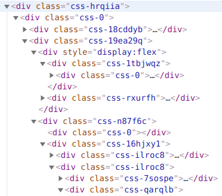
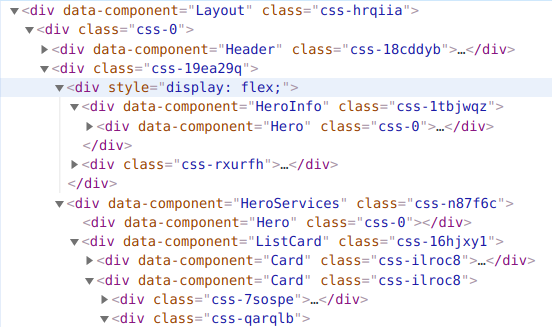

# babel-plugin-component-name

Automatically detects functional React components, parses their names and adds `data-component="ComponentName"` attribute to component's leading JSX Opening Element.

## Motivation

CSS-in-JS libraries generate many css class hashes. Unlike BEM-approach, generated classes are not human-readable. So it is very hard to debug css in devtools. This plugin is intended to improve development experience.

## Example

without plugin:



with plugin:



## Installation
```
yarn add --dev babel-plugin-component-name
```
or

```
npm  install --save-dev babel-plugin-component-name
```

## Usage

Simply add add-react-displayname to your .babelrc file:
```
{
"plugins": ["component-name"]
}
```

